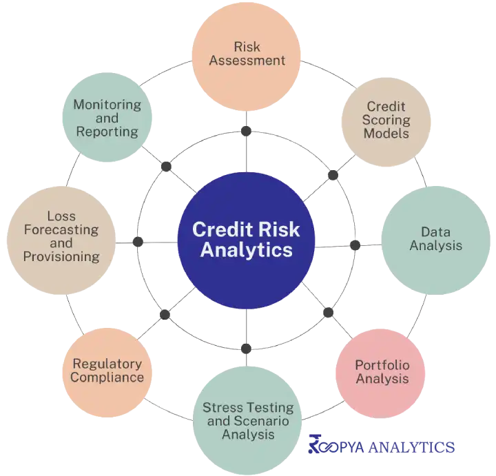

# Data Science Portfolio
---
## Machine learning

### Marketing and Retail Analytics

This project aims to find the underlying buying patterns of the customers of OList which is an e-commerce company that has faced some losses recently and they want to manage their inventory very well so as to reduce any unnecessary costs that they might be bearing. Now to be able to meet the demands of the customers, the company would need to store tons and tons of products in warehouses. Since storing these products adds to the costs that the company incurs, it is necessary for the organization to plan their inventory well.

---
### Lead Scoring Case Study

Lead Scoring is such a powerful metric when it comes to quantifying the lead & it is nowadays used by every CRM. In this repository, we are going to take a look at the UpGrad lead scoring case study and see how can we solve this problem through several supervised machine learning models.

---
### CREDIT EDA BANK PROJECT

Conducted EDA on a bank dataset involving data cleaning, standardization, and visualization. Presented key improvements to enhance the bank's data handling and analysis processes.

---
### RSVP Movies Case Study

Accomplished an SQL-based analysis on the IMDB dataset, offering insights for RSVP Movies' such as top-star casting, release timing, market trends and competitor analysis to enhanced RSVP Movies' decision-making and market performance.

